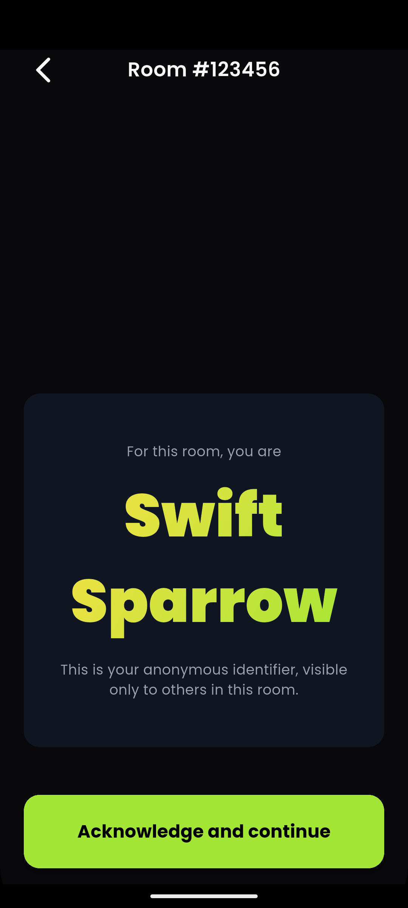
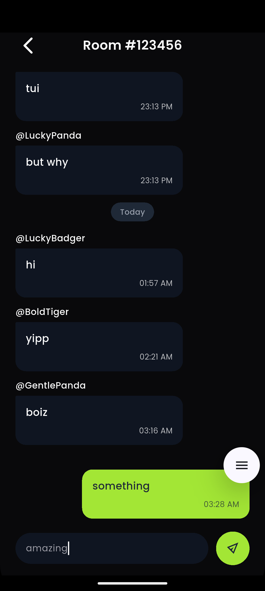

# Rumour — Anonymous Chat Rooms (Flutter + Firebase)

A lightweight, privacy-focused anonymous chat app. Join any 6-digit room, get an auto-generated identity, and chat instantly — no login required.


## Highlights
- 🔒 Anonymous identities (auto-generated per room)
- ⚡ Real-time chat using Firestore streams
- 📡 Room creation + membership tracking
- 📥 Pagination (load older messages on scroll)
- 🔐 Encrypted local identity storage (Hive)
- 🚀 Dev + Prod flavors with separate Firebase configs
- 🧱 Clean architecture with Bloc, Repository, and DI


## Screenshots

Screenshots are stored under `screenshots/` in the repository.

**Join Room Page**


**Room Acknowledge Page**



**Chat Room Page**




## Download APK
👉 **[Download Latest Release](https://github.com/TusharSharmaIN/rumour_app/releases)**  


## Quick Start

### 1. Install dependencies
```
flutter pub get
```
### 2. Run (Dev)
```
flutter run --flavor dev -t lib/main_dev.dart
```
### 3. Run (Prod)
```
flutter run --flavor prod -t lib/main_prod.dart
```
### 4. Build Release APK
```
flutter build apk --flavor prod -t lib/main_prod.dart --release
```

Notes
- Run codegen after model changes:
```
flutter pub run build_runner build --delete-conflicting-outputs
```
- If Hive adapter typeIds change, clear app data or uninstall app to reset local DB.

Features
- Join chat room using a 6-digit room ID
- Anonymous username generated per room
- Acknowledgement screen before entering
- Real-time messages via Firestore
- Auto-scroll and message pagination
- Local encrypted identity via Hive
- Full cleanup on navigation (back pressed)
- Separate Firebase projects for dev/prod

Architecture
- presentation/   → UI pages & widgets
- bloc/           → RoomBloc (state management)
- domain/         → Entities & repository contracts
- infrastructure/ → Firebase + Hive data sources, repositories
- config/         → Flavor + environment config
